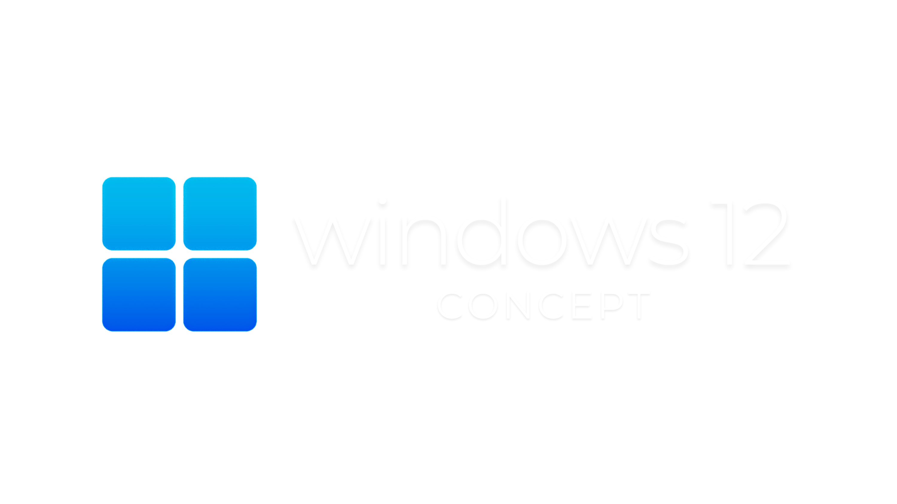
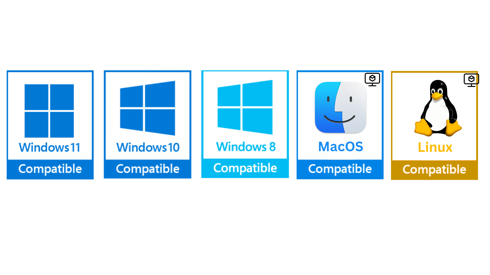

# THIS REPOSITORY IS CURRENTLY UNDERGOING A REVAMP. A LOT OF NEW FEATURES ARE GOING TO BE ADDED. STAY TUNED BY WATCHING THIS REPOSITORY.

## Hopefully, the new version should be out before September 2025

<p align="center">
  
</p>
<p align="center">
  
  *Requires a Windows Virtual Machine for MacOS and Linux
</p>

<h1 align="center">Windows 12 Concept</h1>
<p align="center"><em>A modern, open-source Windows reimagining — crafted with precision and passion by a student developer.</em></p>

---

<p align="center">
  <!-- Project Stats -->
  
  
</p>

<p align="center">
  <!-- Tools Used -->
  
  
  
</p>

---

## 👋 Welcome

Hi there! I’m Jonathan — a high school student who’s passionate about design, productivity, and everything Windows. This project, **Windows 12 Concept**, is my vision for a cleaner, smarter, and more user-centric Windows experience.

It’s free, open-source, and made with ❤️ for the community. If you enjoy it and want to support the project, consider buying me a coffee at [Ko-fi](https://ko-fi.com/jthweb).

---

## 📍 Project Overview

**Windows 12 Concept** is a UI/UX experiment that imagines what a refined version of Windows could look like. From visuals to user flow, every aspect has been reconsidered to enhance usability and give your desktop a fresh look.

This is not an operating system — it is a **customization layer** with themes, widgets, and utilities that enhance the visual and functional experience of Windows 10/11.

---

## ✨ Key Features

- **Windows Intelligence**  
  Integrated with [Writing Tools](https://github.com/theJayTea/WritingTools) to provide intelligent writing support directly on your desktop.

- **Quick Bar**  
  Speedy access to your favorite apps and commands to keep you efficient and focused.

- **Redesigned Interface**  
  Includes a refined File Explorer, themed icons, and clean wallpapers by [Addy Visuals](https://youtube.com/@addyvisuals).

- **Modern Run App**  
  A fully revamped Run interface supporting drag-and-drop, inline command suggestions, and persistent actions.

- **Time Widgets**  
  Stay on top of your schedule with Rainmeter widgets seamlessly blended into the desktop environment.

- **Start Menu Reimagined**  
  Designed for productivity: flyouts for quick tasks and a volume mixer that’s actually usable.

- **Hover-Activated Taskbar**  
  A dock-like taskbar that appears only when needed — clean, functional, intuitive.

- **Easy Configuration Tool**  
  Quickly customize your experience with the Windows 12 Configurator.

- **Custom `winver.exe`**  
  A polished and personalized version information utility.

- **🎥 Coming Soon**: **Video Wallpaper Support**  
  Add motion and ambience with looping background videos.

---

## 📜 Prerequisites

- Windows Terminal
- Windows Powershell 7 or higher
<br>
You can install them using winget by using the below commands
<br>

```bash
winget install --id=Microsoft.PowerShell -e
winget install --id=Microsoft.WindowsTerminal -e
```

---

## 🚀 Installation Guide

To get started, follow these steps:

1. **Star** this repository to support the project.

<br>

2. **Download** the latest release from the [GitHub Releases page](https://github.com/jthweb/Windows-12/releases) and launch it.

<br>

3. **Backup your theme**: Go to `Settings > Personalization > Themes` and save your current setup.

<br>

4. **Launch** `Windows 12 Configurator.exe` to personalize your setup. 

<br>

Select option `2` [Install as Rainmeter skin] when JaxCore is being installed.
5. **Enjoy** a refreshed desktop experience! 🚀 (after rebooting your system)

<br>
<br>

> 💡 Pro Tip: Change your boot splash screen using **HackBGRT**. A sample `splash.bmp` is provided.

---

## 🔄 Uninstall Guide

To restore your original system configuration:

- Run `Windows 12 Removal Tool.exe`.

<br>

- Apply your old theme backed up during the installation.

<br>

- Reboot your computer and uninstall Windows 12 via the **Control Panel**

<br>

> ⚠️ Advanced Users: You may also run `SFC /scannow` in Command Prompt to reset system files. (not recommended)

---

## 🛠 Troubleshooting & Support

- Ensure you're always using the **latest version** from GitHub.
- Avoid restarting during installation.
- If issues arise, visit the [Issues page](https://github.com/jthweb/windows-12/issues) to report them.

---

## 🔎 Additional Tools
 
 Here are some addititonal tools you can use for a better look:
 - [Windhawk](https://windhawk.net) - A Windows customiztion app by editing the souce code (C++)
 - [MicrosoftPowertoys](https://github.com/microsoft/PowerToys) - A Microsoft App to make life easier
 - [MicrosoftPCManager](https://pcmanager.microsoft.com/) - An app for boosting your PC

---

## 🙌 Credits

Special thanks to the creators and projects that helped make this possible:

- [Addy Visuals](https://youtube.com/@addyvisuals) - Wallpaper design
- [JaxCore](https://github.com/jaxcore) - Flyout and Start Menu tools
- [niivu](https://deviantart.com/niivu) - Icon and theme assets
- [Writing Tools](https://github.com/theJayTea/WritingTools) - AI writing support
- [HackBGRT](https://github.com/Metabolix) - Boot splash customization
- [Rainmeter](https://www.rainmeter.net) - Widget framework

---

## 👥 Contributors

<!--Thanks to everyone who has contributed to this project! 💙-->
Thanks to myself since no one has contributed yet! 😄

<a href="https://github.com/jthweb/windows-12/graphs/contributors">
  
</a>

---

## 📬 Contact & Feedback

If you’d like to contribute, collaborate, or just say hi:

📧 Email: [jthweb@duck.com](mailto:jthweb@duck.com)  
☕ Support: [ko-fi.com/jthweb](https://ko-fi.com/jthweb)

---

## 📄 License

Licensed under the [GNU General Public License v3.0](LICENSE).  
You are free to modify, distribute, and share — just give proper credit.

---

## 💡 Want to Contribute?

We welcome new contributors! Whether it's a new idea, a bug fix, or a feature enhancement, your help is appreciated. Check out the [CONTRIBUTING.md](CONTRIBUTING.md) to get started.

---
