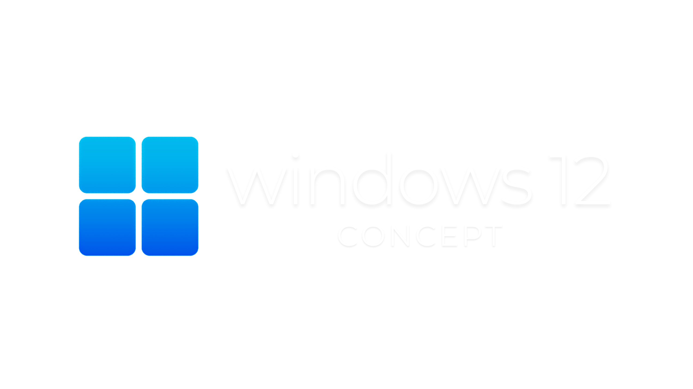

  
  

Imagine starting your day with a [fresh cup of coffee](https://ko-fi.com/jthweb) and a brand-new Windows experience. That’s what this is all about!
<br><br>
A free, open-source Windows 12 concept, crafted with passion.
<br><br>
[](https://forthebadge.com)  
[](https://forthebadge.com)

</div>

----

## 👋 Hey there!

I'm Jonathan, a high school student passionate about tech and the developer behind the Windows 12 Concept.

It’s free, open-source, and made with ❤️.

If you like what I'm building and want to support my work, you can buy me a coffee at [Ko-fi](https://ko-fi.com/jthweb). Your feedback and contributions fuel this project!

---

## ✨ What is Windows 12 Concept?

Windows 12 Concept is an open-source project that envisions a reimagined Windows experience. It features a refreshed design, enhanced functionality, and a user-centric approach.

It’s a concept, not a finished product.

---

## ⚡ What's New?

### 🌟 Windows Intelligence
- Integrated with "Writing Tools" by [theJayTea](https://github.com/theJayTea/WritingTools) for smarter writing assistance.

### 🚀 Quick Bar
- Fast access to your favorite apps and commands, boosting productivity.

### 🎨 Redesigned Interface
- Includes the new Windows 12 Themepack.
- A sleek file explorer with custom icons.
- Minimalist wallpapers by [Addy Visuals](https://youtube.com/@addyvisuals).

### 🔍 Run App Revamp
- Search commands, drop files, and pick them up later.
- Simple and efficient.

### ⏳ Time Widgets
- Stay organized with seamlessly integrated Rainmeter widgets.

### 🏠 All-New Start Menu
- Improved productivity with fluid flyouts and a revamped volume mixer.

### 🖥️ Updated Winver
- A custom `winver.exe` for Windows 12.

### 🖥️ Dock Taskbar
- A hidden taskbar that appears on hover for smoother navigation.

### ⚙️ Configurator
- A dedicated setup tool for easy customization.

---

## 📦 Installation Guide

1. **Star the repo** and download the latest release from [GitHub Releases](https://github.com/jthweb/Windows-12/releases).
2. **Backup your current theme** via `Settings > Personalization > Themes`. Save it as a `.deskthemepack` file.
3. **Run the installer** and follow the steps.
4. **Launch** `Windows 12 Configurator.exe` and complete the setup.
5. **Enjoy** your fresh Windows 12 experience! 🚀

> 💡 *Tip:* Use HackBGRT to change your boot logo! Find `splash.bmp` in the installation directory.

---

## 🔄 Uninstallation Guide

Uninstalling Windows 12 **won’t** revert all changes automatically. To restore your system:

- Use the **Restore** option in **7tsp Icon Patcher**.
- Uninstall **UltraUXThemePatcher**, **OldNewExplorer**, and **Explorer Blur Mica**.
- Reapply your saved `.deskthemepack` theme.
- Remove any shortcuts in `shell:startup`.
- Reboot your computer, then uninstall Windows 12 via **Control Panel** or the **Start Menu**.

Alternatively, run:
`SFC /scannow`
in **Command Prompt** *(not recommended)* for faster restoration.

> ⚠ **Warning:** Follow the steps carefully to avoid installation or uninstallation issues.

---

## 🛠️ Troubleshooting

- Ensure you're using the latest version.
- Avoid rebooting during installation.
- Report issues via **GitHub Issues**.

---

## 📜 References & Credits

Special thanks to:

- **Cursor** - [JepriCreations](https://deviantart.com/jepricreations)
- **Quick Bar** - [YASB by AmN](https://github.com/amnweb)
- **Base Theme & Icons** - [niivu](https://deviantart.com/niivu)
- **HackBGRT** - [Metabolix](https://github.com/Metabolix)
- **Rainmeter** - [Rainmeter.net](https://www.rainmeter.net)
- **Windows Intelligence** - [Writing Tools by theJayTea](https://github.com/thejaytea)
- **Start Menu & Flyout** - [JaxCore](https://github.com/jaxcore)

### My Contributions:
- Developed Windows 12 `winver.exe` & Run App *(drag/drop was tough!)*
- Designed a new taskbar.
- Customized **YASB** configuration.
- Compiled and packaged everything.
- Built the installer.

---

## 📬 Contact

Reach out at [jthweb@duck.com](mailto:jthweb@duck.com) for feedback and contributions.

**Made with ❤️ by a high school student.** Explore more projects on my [GitHub](https://github.com/jthweb)!

---

## 📄 License

This project is licensed under the [GNU General Public License v3.0](LICENSE). You are free to modify and distribute this software under the same license with proper credit.

---

## ⚠️ Disclaimer

This software is provided "as is," without warranty. It is a conceptual theme and is **not affiliated with or endorsed by Microsoft**.

---

```javascript
try {
    if (u_scrolled_till_here) {
        star_repo();
        return "Thanks in advance!";
    }
} catch {
    if (u_liked_this_project) {
        share_repo(let_others_use);
    }
} finally {
    return "Thanks for checking it out! Explore my other projects.";
}
```
---

